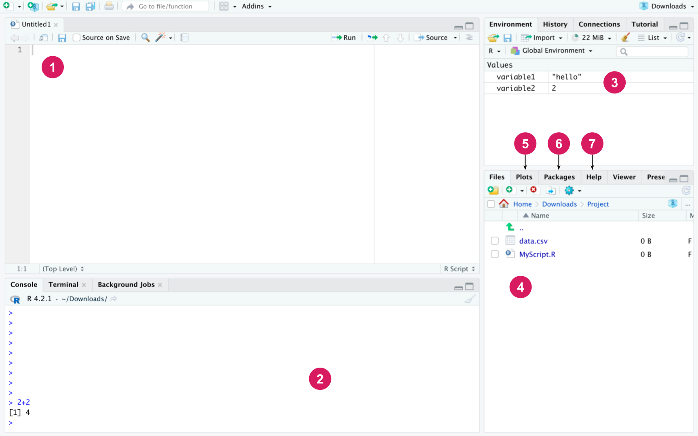
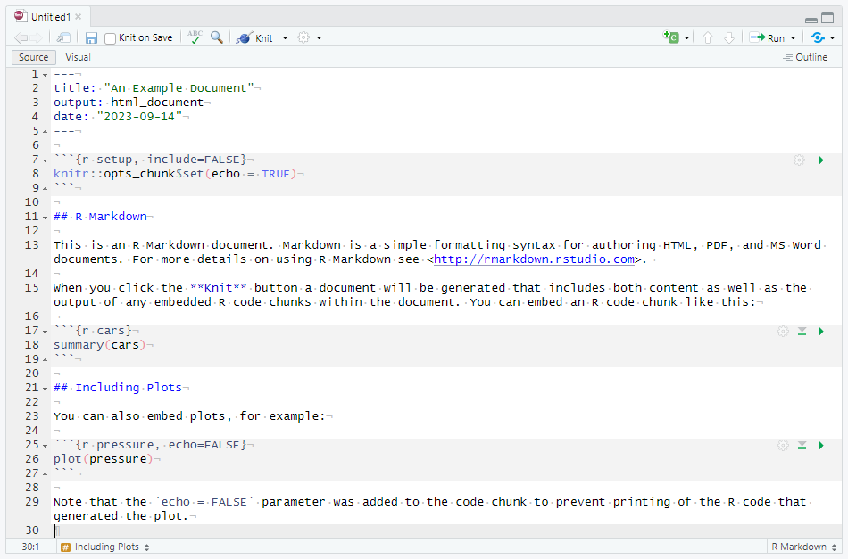
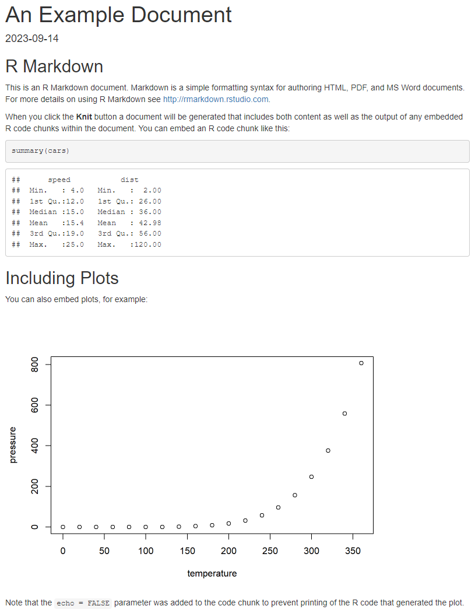

# R 기초 {#sec-intro-r}

**저자:** Santtu Tikka, Juho Kopra, Merja Heinäniemi, Sonsoles López-Pernas, Mohammed Saqr

::: {.callout-note title="초록"}
R 프로그래밍 언어는 학습분석학 분야에서 데이터 분석을 수행하기 위한 인기 있는 도구로 자리 잡았다. 이 장에서는 RStudio 통합 개발 환경과 tidyverse 프로그래밍 패러다임에 초점을 맞추어 R 프로그래밍의 기초를 소개한다. 이 장에서는 데이터 유형과 구조, 제어 구조, 파이프, 함수, 반복문, 입출력 작업과 같은 주제를 다룬다. 이 장을 마칠 때쯤이면 독자는 R 프로그래밍의 기초를 탄탄히 이해하고, 데이터 다루기 및 R을 이용한 기초 통계와 같은 더 심화된 주제를 학습하는 데 필요한 도구를 갖추게 될 것이다.
:::

## 서론

R은 통계 계산과 데이터 분석을 위해 특별히 설계된 무료, 다목적, 오픈소스 프로그래밍 언어이자 소프트웨어 환경이다. R에는 데이터 조작, 시각화, 모델링, 머신러닝을 가능하게 하는 방대한 패키지 라이브러리가 있다 \[1\]. 이처럼 풍부한 패키지 덕분에 사용자는 시간과 노력을 절약하거나 복잡한 코드를 직접 작성할 필요 없이 폭넓은 기능을 활용할 수 있다. R이 무료로 제공된다는 사실은 이러한 모든 기능을 누구나 이용할 수 있게 해준다. R에는 개발자, 사용자, 연구자로 이루어진 큰 커뮤니티가 있으며, 이들은 플랫폼의 개발을 지원하는 한편 StackExchange와 같은 인기 사이트에서 지원과 지식을 공유한다. 이에 따라 R은 학생, 연구자, 데이터 과학자들 사이에서 점점 더 인기 있는 선택지가 되고 있다 \[2\].

오픈소스이며 연구자들이 자유롭게 접근할 수 있다는 특성 덕분에, R이 제공하는 가능성과 기능을 확장하는 여러 패키지가 계속해서 추가되고 있다. 이 책에 포함된 R 패키지 중 일부는 최근 몇 년 사이 연구자들이 당대의 과학적 문제와 최신 혁신을 다루기 위해 추가한 것이다 \[3\]. 예를 들어, 심리적 네트워크 분석을 위한 R 소프트웨어 패키지는 지난 5년 사이에 개발되었으며, 그 이후로 많은 연구자 기반의 기여 덕분에 폭발적으로 성장해왔다 \[4\].

이 책에서 설명하는 많은 방법론이 다른 소프트웨어 도구로도 구현될 수 있지만, 이처럼 성숙도와 성능, 다양한 가능성을 갖추고 사실상 모든 기존 학습분석학 방법론을 수행할 수 있는 포괄적인 플랫폼을 찾기는 어렵다. 예를 들어, 사회 네트워크 분석(Social Network Analysis, SNA)은 여러 프로그래밍 언어(예: Python)와 데스크톱 소프트웨어 애플리케이션(예: Gephi)으로도 수행할 수 있다 \[5\]. 그러나 이 두 선택지 모두 SNA 분석에서 R이 제공하는 것에 비하면 제한적인 기능을 제공한다. 여기에는 더 폭넓은 범위의 SNA 중심성 지표, 수학적 모형, 커뮤니티 탐지 알고리즘, 생성 모형이 포함된다. 순차 분석 역시 R이 제공하는 가능성을 다른 소프트웨어 솔루션으로 따라가기 어려운 또 다른 예다.

이 책은 R이 다른 어떤 플랫폼보다 우월하다고 가정하지 않는다. 다른 언어와 소프트웨어 플랫폼들도 실제로 매우 유용하며 연구자들을 위한 방대한 기능을 갖추고 있다. 예를 들어, Python은 머신러닝을 위한 놀라운 도구를 갖추고 있고, Gephi는 네트워크 시각화를 위한 아름다운 그래픽을 제공한다. 종종 독자는 특정 작업을 수행하기 위해 다른 도구를 배우거나 사용해야 할 수도 있다. 달리 말하면, R이 연구자를 위한 풍부한 도구 모음을 제공하는 만큼, 연구자가 특정 작업을 완수하기 위해 사용할 수 있는 다른 도구들을 위한 자리도 존재한다. 요약하면, R을 배우는 데 시간을 투자하는 것은 관심 있는 연구자가 자신의 연구 역량과 도구 모음을 수행하고 확장하는 데 도움이 되는 가치 있는 노력이다. R은 거대한 플랫폼이기 때문에, 계속해서 확장되는 함수와 패키지의 방대한 가능성으로 향하는 관문이 된다.

## R 학습하기

프로그래밍의 목표는 원하는 작업을 수행하는 프로그램을 작성하는 것, 즉 코드를 작성하는 것이다. 프로그램은 여러 개의 명령으로 구성되며, 각 명령은 매우 단순한 일을 수행한다. 통계와 데이터 분석의 맥락에서 R은 흔히 스크립트라고 불리는 짧은 프로그램을 작성하는 데 사용된다. 따라서 R은 게임이나 다른 복잡한 프로그램을 개발하기 위한 것이 아니다. R은 또한 원래 웹 프로그래밍을 위해 만들어진 언어가 아니지만, 적절한 패키지를 사용하면 R로도 웹 애플리케이션을 만들 수 있다.

R은 고급 프로그래밍 언어다. 이는 R에 이미 만들어져 있는 명령이 많으며, 그 "아래"에는 R 프로그래머가 직접 다룰 필요가 없는 훨씬 더 많은 코드가 존재한다는 것을 의미한다. 예를 들어, 통계적 t-검정은 여러 수학적 중간 단계를 필요로 하지만, R 프로그래머는 필요한 모든 계산과 검정에 대한 정보를 제공하는 단일 명령(`t.test`)으로 검정을 수행할 수 있다.

R 코드를 사용하고 프로그래밍하는 방법을 배우는 가장 좋은 방법은 직접 해보는 것이다. 이 텍스트에는 아래 예시처럼 회색 상자 안에 본문 사이사이 R 코드가 삽입되어 있다. 두 개의 해시, 즉 `##`로 시작하는 줄은 코드가 아니라 코드를 실행해서 생성된 출력이다. 먼저 고전적인 "Hello, world!" 명령을 예로 들어보자.

```{r}
print("Hello, world!")
```

print 함수는 주어진 텍스트를 콘솔에 출력한다. 이는 예를 들어 프로그램의 작동을 테스트하고 더 긴 프로그램의 진행 상황을 모니터링하는 데 편리하다. R은 계산기로도 사용할 수 있다. 아래 예에서는 원래 80유로였던 제품에 35% 할인을 적용한 후의 가격을 계산한다.
```{r}
80 * (1 - 0.35)
```

그러나 개별 명령을 실행하는 것은 그 결과를 어딘가에 저장할 수 없다면 대체로 유용하지 않다. 프로그래밍 언어에서 데이터는 변수에 저장되며, 이는 이후에 익숙해질 것이다.

## RStudio

R에는 코드를 작성하고 관리하는 것을 더 쉽고 접근하기 쉽게 만들어주는 다양한 도구와 통합 개발 환경(IDE)이 있다. 가장 널리 사용되는 R IDE는 RStudio로, 이는 R과 마찬가지로 모든 주요 운영체제에서 실행되는 무료 오픈소스 소프트웨어다 \[6\]. RStudio는 R 코드를 작성, 실행, 디버깅하기 위한 포괄적이고 사용자 친화적인 인터페이스를 제공하여 사용자가 더 쉽게 시작하고 더 생산적으로 작업할 수 있도록 해준다. R과 RStudio를 함께 사용하면 재현 가능한 연구를 만들 수 있다. 코드와 결과를 쉽게 공유하고 재현할 수 있어, R과 RStudio는 협업과 투명성을 위한 훌륭한 도구가 된다.

R과 RStudio는 다양한 유형의 데이터를 분석하고 시각화하는 데 매우 유용할 수 있다. 이는 연구자, 교육자, 관리자가 데이터에 기반한 의사결정을 내리고 학생들의 학습 경험을 개선하는 데 도움이 될 수 있다. 학생의 성취도를 분석하든, 인구통계 데이터를 분석하든, 교수법 개입의 효과를 추적하든, R과 RStudio는 목표를 달성하기 위한 유연하고 효율적인 플랫폼을 제공한다.

먼저 [R을 설치](https://www.r-project.org/)하고(1단계), 그런 다음 사용 중인 운영체제에 맞는 [RStudio](https://posit.co/download/rstudio-desktop/#download) 데스크톱을 설치한다. R과 RStudio는 다양한 운영체제에서 사용할 수 있다. @fig-rstudio 에 나타난 RStudio의 인터페이스는 다음과 같은 기본 구성 요소로 이루어져 있다.

{#fig-rstudio fig-align="center"}

(1) *편집기(Editor)*: 편집기는 R 코드, 즉 R 스크립트를 담은 파일을 작성하는 데 사용된다. 스크립트는 이후에 소개하겠지만, 간단히 말해 함께 배치되었을 때 특정 작업, 예컨대 연구 프로젝트의 데이터를 분석하거나 완성된 결과의 그림을 그리는 작업을 수행하는 R 명령의 모음이다. "File" 메뉴에서 "New File"을 선택한 다음 "R script"를 선택하면 새 스크립트를 열 수 있다. Windows와 Linux에서는 Ctrl + Shift + N 키보드 단축키로도 같은 작업을 수행할 수 있다. macOS에서는 Cmd + Shift + N을 사용할 수 있다. 또한 사용 가능한 모든 단축키는 "Tools" 메뉴의 "Keyboard Shortcuts Help"에서 확인할 수 있다. 편집기에 작성된 코드는 해당 줄에서 Ctrl + Enter를 눌러 한 줄씩 실행할 수 있다. 여러 줄을 선택해서 한 번에 실행할 수도 있다. 상단의 Source 버튼은 현재 파일의 모든 코드를 실행한다. R 스크립트는 다른 파일과 마찬가지로 저장할 수 있으며 파일 확장자는 .R이다. 데이터를 분석하는 데 사용하는 모든 코드는 스크립트에 작성해야 한다. 이렇게 코드를 저장해두면, 다음번에는 코드를 처음부터 다시 작성하는 대신 스크립트를 실행하기만 하면 원하는 작업을 수행할 수 있다.

(2) *콘솔(Console)*: R 명령은 콘솔에서 실행된다. 편집기에 작성된 코드를 실행하면 RStudio는 자동으로 콘솔에서 해당 명령을 실행한다. 콘솔에서는 Enter 키를 누르는 것만으로 한 줄의 코드를 실행할 수 있다. 콘솔에 2 * 3과 같은 계산식을 작성하고 Enter를 눌러보면 콘솔에 결과가 출력되는 것을 확인할 수 있다. 편집기에 코드를 작성하고 Ctrl + Enter를 눌러도 같은 결과를 얻을 수 있다. 발생할 수 있는 메시지, 경고, 오류 또한 콘솔에 출력된다. 콘솔과 편집기의 주된 차이는 콘솔에 작성한 명령은 어떤 파일에도 저장되지 않는다는 점이다. 따라서 코드를 보존하고 싶다면 편집기에 작성해서 스크립트 파일로 저장해야 한다. 같은 세션 중에 실행한 명령은 위아래 화살표 키로 콘솔에서 스크롤해볼 수 있다. 또한 명령 기록은 RStudio의 History 탭에서 확인할 수 있다.

(3) *작업 공간(Workspace)*: 현재 R 세션의 작업 환경에 있는 변수들을 표시한다.

(4) *파일(Files)*: 기본적으로 작업 디렉터리인 운영체제의 디렉터리 구조를 보여준다.

(5) *플롯(Plots)*: R로 그린 그래픽이 여기에 나타난다.

(6) *패키지(Packages)*: 여기에서 설치된 패키지를 관리할 수 있다(패키지 설치 방법은 아래에 나와 있다).

(7) *도움말(Help)*: 여기에서 모든 R 명령에 대한 설명이 담긴 R 매뉴얼을 찾아볼 수 있다. 편집기나 콘솔에서 `?print` 명령을 실행해보면 `print` 함수의 도움말 페이지가 열리는 것을 확인할 수 있다.

## 프로그래밍 모범 사례

"스크립트"라는 단어가 이미 시사하듯, 데이터 분석은 흔히 파일에서 측정값을 읽어오고, 표를 정리하고, 예컨대 서로 다른 표본 집단의 평균을 계산하고 그림을 그려 분석 결과를 기술하는 등 다양한 단계로 이루어진 "스크립트"를 필요로 한다. 이러한 단계를 수행하는 R 명령을 스크립트에 작성해두면 분석이 어떻게 이루어졌는지에 대한 문서를 제공할 수 있고, 나중에 다시 살펴보거나 t-검정 수행과 같은 몇 가지 추가 단계를 덧붙이기도 쉽다. 스크립트 파일은 (파일 이름, 표 구조 등) 약간의 수정만으로 다른 데이터셋과 작업 흐름에도 같은 코드를 사용할 수 있기 때문에, 비슷한 데이터 분석 작업을 하는 다른 사람들과 공유하기도 쉽다. 코드 안에는 흔히 주석이 사용된다. 주석은 R 명령과 함께 작성되는 텍스트로, 프로그래밍 언어로 작성되지 않으며 코드를 실행할 때 무시된다. 주석의 목적은 코드의 동작과 목적을 설명하는 것이다. 첫 작업의 코드가 아주 단순하더라도 처음부터 자신의 코드에 주석을 다는 습관을 들이는 것이 좋다. R에서 주석은 ## 기호로 표시한다.

```{r}
## Assign arbitrary numbers to two variables
x <- 3
y <- 5
## Sum of two variables
z <- x + y
## Print the results
z
```

### R Markdown

스크립트에는 코드와 주석만 저장할 수 있는 반면, RStudio에는 R Markdown이라는 더 포괄적인 형식도 있다. R Markdown은 텍스트, 코드, 시각화를 통합할 수 있는 동적 보고서와 인터랙티브 노트북을 만들 수 있게 해주는 Markdown 마크업 언어의 확장이다. R Markdown 문서는 일반 텍스트 형식으로 작성되며 HTML, PDF, Word, 심지어 프레젠테이션과 같은 다양한 출력 형식으로 렌더링될 수 있다. RStudio에서 새 R Markdown 문서를 만들려면 "File" 메뉴로 가서 "New File"을 선택한 다음 "R Markdown"을 선택한다. 열리는 대화창에서 사용하고자 하는 출력 형식을 선택하고 문서에 제목을 붙인다. @fig-rmarkdown 은 RStudio의 기본 R Markdown 문서에 대한 편집기 패널을 보여준다.

{#fig-rmarkdown fig-align="center" width=80%}

문서 상단에서 `---` 구분자 사이에 감싸인 YAML 메타데이터는 다양한 방식으로 출력과 내용을 커스터마이즈하는 데 사용될 수 있다. 예를 들어, 제목이나 저자를 바꾸거나 목차를 추가할 수 있다. 이 예시에서는 제목, 출력 형식(HTML), 날짜를 정의했지만, 이 외에도 훨씬 더 많은 옵션을 사용할 수 있다. 텍스트를 서식화하려면 Markdown 문법을 사용하고, R 코드는 ```` ```{r} ```` 와 ```` ``` ```` 태그로 감싸며 여기에 다른 옵션도 제공할 수 있다. 예를 들어, 우리의 첫 코드 청크에는 `setup`이라는 라벨이 붙어 있고, `include = FALSE`라는 옵션은 이 청크가 실행되기는 하지만 그 출력은 최종 문서에 출력되지 않음을 의미한다. 청크 안에서는 전역 `knitr` 옵션이 설정되어 모든 코드 청크가 기본적으로 자신의 출력을 표시(echo)하도록 한다. 계산 결과나 다른 R 객체를 빠르게 참조하기 위해 인라인 청크를 사용할 수도 있다. 이 문서에 사용된 표준 Markdown 문법의 몇 가지 예로는 `##`로 표시되는 2단계 제목(R Markdown 문서에서는 `#`이 주석으로 쓰이지 않는다는 점에 유의하자)과 텍스트를 `**`로 감싸서 나타내는 굵은 글씨가 있다. 문서 작성이 만족스러우면 RStudio의 "Knit" 버튼을 클릭하거나 키보드 단축키 "Ctrl + Shift + K"를 사용해서 선택한 출력 형식으로 렌더링할 수 있다. @fig-html-md 는 그에 해당하는 렌더링된 HTML 문서를 보여준다.

{#fig-html-md fig-align="center" width=60%}

이 단순한 예시는 R Markdown 문서와 Markdown 문법이 지닌 전체 기능 중 극히 일부만을 보여준다. R Markdown은 재현 가능한 연구 보고서, 교육 자료, 심지어 웹사이트를 만들기 위한 강력한 도구다. 이를 통해 사용자는 코드와 출력을 자신이 작성하는 글에 매끄럽게 통합할 수 있어, 분석을 공유하고 재현하기가 더 쉬워진다. R Markdown 문서의 대안으로 RStudio는 본질적으로 인터랙티브한 R Markdown 문서라 할 수 있는 R Notebook의 작성도 지원한다. R Notebook은 예컨대 하나의 포괄적인 분석 보고서를 만드는 것이 목표가 아니라 코드를 기록해두고 문제에 대한 다양한 접근법을 인터랙티브하게 시도해보는 것이 목표일 때 유용할 수 있다. R Markdown에 대한 심화 가이드는 \[7\]을 참고하라. 이는 <https://bookdown.org/yihui/rmarkdown/> 에서도 무료로 볼 수 있다.

### 코드는 어떻게 개발되는가?

코드 개발은 대체로 다음과 같은 단계를 따른다.

1. 코드의 각 부분을 설계한다.
2. 작은 코드 조각을 작성하는 것부터 시작한다.
3. 작성한 코드가 작동하는지 테스트한다. 작동하지 않는다면 그 이유를 찾아 수정한다.
4. 다음 코드 조각으로 넘어가서 같은 방식으로 계속하며, 항상 코드가 작동하는지를 조각 단위로 테스트한다.

이 자료와 더불어, 많은 패키지에는 패키지와 관련된 기본 작업과 함수를 요약한 "치트 시트(Cheat Sheet)"가 포함되어 있다. 치트 시트는 R에서 무언가를 하는 방법이 외워지지 않을 때 이를 빠르고 쉽게 확인할 수 있는 참고 자료를 제공한다. 인터넷에는 다양한 R 패키지와 그 밖의 것들을 위한 치트 시트가 있는데, 예를 들어 base R 치트 시트나 `tidyr` \[8\] 치트 시트가 있다.

이 장에서 소개하는 기본 명령 외에도, 실제 R 프로그래밍은 과학 커뮤니티가 개발한 다양한 패키지의 사용에 크게 의존한다. 패키지는 새로운 함수, 클래스, 데이터를 포함하는 코드 모음으로, 즉 R을 확장하는 역할을 한다. 대부분의 R 패키지는 Comprehensive R Archive Network(CRAN)에서 받을 수 있다. 패키지는 `install.packages()` 함수로 설치하거나, 실제로는 `install.packages()` 함수를 호출하는 RStudio의 설치 창을 통해 설치할 수 있다. 여러 패키지를 한 번에 설치할 수도 있다. 아래 명령은 `dplyr` \[9\] 와 `tidyr` 패키지를 설치한다.

```{r}
#| eval: false
#| message: false
install.packages(c("dplyr", "tidyr"))
```

R 패키지에 담긴 명령을 사용하려면 그 패키지가 설치되어 있어야 하고 R 작업 공간에 연결(attach)되어야 한다. 이는 `library()` 명령으로 수행한다.

```{r}
#| warning: false
library("tidyr")
```

이제 `tidyr` 패키지가 로드되었으므로, 나중에 다룰 학습분석학 데이터를 데이터 프레임 형식으로 관리하는 등 이 패키지가 제공하는 명령을 사용할 수 있다. 패키지 전체를 연결하고 싶지 않다면, `패키지_이름::명령_이름()` 형식으로 패키지의 개별 명령을 사용할 수 있다.

## 기본 연산

R의 기본 연산에는 산술 연산, 논리 연산, 할당이 있다. 이 외에도 새 프로젝트를 시작하거나 작업 디렉터리를 관리할 때 흔히 유용한 여러 명령이 있다. 예를 들어, 다음 명령으로 현재 작업 디렉터리를 확인할 수 있다.

```{r}
getwd()
```

### 산술 연산자

R은 덧셈(`+`), 뺄셈(`-`), 곱셈(`*`), 나눗셈(`/`), 거듭제곱(`^`)과 같은 기본 산술 연산을 계산하는 데 사용할 수 있다. 이러한 연산은 표준 우선순위 규칙을 따르며, 필요하다면 괄호를 추가해서 계산 순서를 조정할 수 있다.

```{r}
1 + 1 ## Addition
2 - 1 ## Subtraction
2 * 4 ## Multiplication
5 / 2 ## Division
2 ^ 4 ## Exponentiation
```

### 관계 연산자

관계 연산자는 객체나 값을 다른 객체나 값과 비교한다. 이 연산자들은 예컨대 어떤 기준을 만족하는 개체들의 부분집합을 선택할 때처럼, 조건부로 데이터를 필터링할 때 흔히 필요하다. R에는 다음과 같은 여섯 가지 연산자가 있다: 작다, 크다, 작거나 같다, 크거나 같다, 같다, 같지 않다. 이 연산자들은 R에서 다음과 같은 문법을 가진다.

```{r}
1 < 2  ## Smaller than
3 > 2  ## Greater than
2 <= 2 ## Smaller or equal to
3 >= 3 ## Greater or equal to
5 == 5 ## Equal to
1 != 2 ## Equal to
```

앞의 예에서는 이 연산자들을 이용해 정수를 비교했지만, 문자와 같은 다른 유형의 값을 비교하는 데도 사용할 수 있다.

```{r}
"a" == "b"
```

### 논리 연산자

관계 연산자와 마찬가지로, 논리 연산자는 두 논리값의 결합에 대한 논리적 값을 평가하는 데 사용된다. R에는 다음과 같은 다섯 가지 논리 연산자가 있다: 부정, AND, OR, 원소별 AND, 원소별 OR. 이 연산자들은 다음과 같은 문법을 가진다.

```{r}
!TRUE         ## Negation
TRUE && TRUE  ## Logical AND
TRUE || FALSE ## Logical OR
TRUE & TRUE   ## Elementwise AND
TRUE | FALSE  ## Elementwise OR
```

원소별 연산자 `&`와 `|`는 예컨대 다음과 같이 여러 쌍의 논리값을 동시에 비교하는 데 사용할 수 있다.

```{r}
c(TRUE, FALSE, TRUE) | c(TRUE, FALSE, FALSE)
```

반면 `&&`와 `||` 연산자는 단일 값만 받는다. 위의 예에서는 R의 가장 중요한 연산 중 하나인 `c()` 함수('c'는 "combine"의 줄임말이다)도 사용했는데, 이는 논리값들을 벡터, 즉 같은 유형의 값들로 이루어진 순서 있는 수열로 결합하는 데 사용했다. 벡터와 그 밖의 중요한 데이터 유형은 다음 절에서 더 자세히 다룬다.

### 특수 연산자

R의 또 다른 핵심 기능은 할당 연산자 `<-`이다. 할당은 계산 결과를 변수에 저장해두어, 원래의 계산을 다시 하지 않고도 다른 계산에서 그 결과를 다시 사용할 수 있게 한다. 예를 들어

```{r}
x <- 5 ## Assign value 5 into variable named x
y <- 7 ## Assign value 7 into variable named y
x      ## Access value of x (value is printed into the console in RStudio)
y      ## Access value of y
x + y  ## Compute the sum of x and y
x > y  ## Is x greater than y?
```

여기서는 변수 이름으로 `x`와 `y`를 선택했지만, 이름은 임의로 정해도 되며, 다만 `c()`, `exp()`, `lm()`과 같이 R이 내부적으로 이미 사용하고 있는 흔한 함수 이름을 객체 이름으로 사용하는 것은 피해야 한다는 점에 유의해야 한다. 현재 작업 환경에 할당되어 있는 변수들은 다음 명령으로 확인할 수 있다.

```{r}
ls()
```

등호 `=`를 할당 연산자로 사용하는 것도 가능하지만, 등호는 R 언어에서 다른 용도로도 쓰이기 때문에 할당에 사용하면 혼란을 일으킬 수 있어 권장되지 않는 경우가 많다. 등호가 `<-`와 동일하게 작동하지 않는 특수한 경우도 있다. 따라서 우리는 항상 표준 할당 연산자인 `<-`를 사용할 것을 권장한다.

벡터를 만들 때, 어떤 경우에는 `c()` 함수를 사용하는 것이 번거로울 수 있다. 예를 들어 1부터 100까지의 모든 정수를 담은 벡터를 만들고 싶다고 하자. `c()`를 사용하면 각 값을 일일이 작성해야 한다. 다행히 이러한 수열은 `:`(콜론) 연산자를 사용해서 손쉽게 만들 수 있다.

```{r}
1:100
```

우리는 종종 벡터에서 특정 값만 선택하고 싶을 때가 있다. 벡터의 값들은 1부터 시작하는 인덱스로 접근할 수 있다. 이는 다음과 같은 대괄호 문법을 사용하는 부분집합 연산자로 수행된다. 예를 들어, 벡터 `x`의 첫 번째 값은 `x[1]`이라고 써서 선택할 수 있다. 좀 더 복잡한 예로, `1:100` 벡터의 첫 번째, 50번째, 100번째 값을 동시에 선택하려면 다음과 같이 쓸 수 있다.

```{r}
x <- 1:100
x[c(1, 50, 100)]
```

즉, 선택하고자 하는 값들의 위치를 벡터 형태로 대괄호 안에 적는 것이다. 다른 방법으로는, 우리가 선택하려는 벡터와 길이가 같은 논리값 벡터를 만들어, 선택하고자 하는 값에는 `TRUE`를, 그렇지 않은 값에는 `FALSE`를 부여할 수도 있다. 다음 절에서는 조건에 기반해 값을 선택하는 방법도 보여준다.

## 기본 데이터 유형과 변수

앞 절의 예시들에서 우리는 실제 데이터 분석에서 사용자가 가장 흔히 마주치게 될 가장 일반적인 데이터 유형 몇 가지를 이미 사용했다. R의 각 객체는 유형(type)을 가지며, 이는 `typeof()` 함수로 확인할 수 있다. 유형은 우리가 관심을 갖는 변수가 어떤 종류의 데이터를 담고 있는지, 그리고 그 변수에 대해 어떤 연산을 수행할 수 있는지를 설명하는 데 사용된다. 아마도 가장 흔한 유형은 숫자로 해석될 수 있는 값을 나타내는 `numeric` 유형일 것이다. `numeric` 유형의 두 가지 특별한 경우로 `integer`와 `double`이 있는데, 이는 각각 정수 값과 소수 값에 대응한다.

```{r}
typeof(1.0)
typeof(1L)
```

두 번째 줄의 대문자 `L`은 우리가 말하는 것이 소수 1.0이 아니라 정수 1임을 나타낸다. 텍스트 데이터는 흔히 `character` 유형으로 표현된다. 일부 다른 프로그래밍 언어와 달리, R에서 `character` 유형은 이름이 시사하는 것처럼 반드시 개별 문자를 나타내는 것이 아니라 문자열을 나타낸다. 예를 들면

```{r}
typeof("a")
typeof("hello world!")
```

보다시피 둘 다 같은 유형을 갖는다.

`logical` 유형은 불리언 값 `TRUE`와 `FALSE`를 나타내는 데 사용된다. 논리값은 실제 데이터에서는 그러한 값이 정수 1과 0으로 표현되는 경우가 많기 때문에 그렇게 흔하지는 않다. 그러나 논리값의 중요성은 우리 데이터의 일부 대상에 대해서만 참인 어떤 기준에 기반해 수행하고자 하는 데이터 필터링 및 조작을 위한 조건을 형성하는 데 있다. 예를 들어 값 1, 2, 3, 4, 5가 있고, 이 중 2보다 큰 값만 프로그램적으로 선택하고 싶다고 하자. 이는 다음과 같이 수행할 수 있다.

```{r}
some_numbers <- 1:5
some_numbers[some_numbers > 2]
```

위 코드가 하는 일을 단계별로 살펴보자. 첫 번째 줄에서는 `:` 연산자를 이용해 1부터 5까지의 숫자값으로 이루어진 벡터를 만들고, 그 결과를 `some_numbers`라는 변수에 할당한다. 두 번째 줄에서는 대괄호(부분집합 연산자)를 이용해 `some_numbers`의 값들 중 `some_numbers > 2`라는 조건이 참인 값들만 선택한다.
여기서 우리는 대다수의 산술 연산자와 관계 연산자에 적용되는 R의 벡터화(vectorization) 기능을 소개한다. `some_numbers > 2`라고 작성하면, 실제로는 벡터 `some_numbers`의 모든 값에 대해 그 조건을 평가하게 된다.

```{r}
some_numbers > 2
```

앞서 언급한 모든 유형은 원자적(atomic) 유형이라고 불리는데, 이는 그러한 값들로 이루어진 벡터가 하나의 특정한 원자적 유형에 속하는 값만을 담을 수 있음을 의미한다. 예를 들어, 하나의 벡터는 문자 유형과 정수 유형의 값을 동시에 담을 수 없다.

```{r}
c(0L, "a")
```

결과가 자동으로 원자적 문자 벡터로 변환된 것을 볼 수 있다.

유형과 더불어, R의 객체는 클래스(class)도 가지며, 이는 `class()` 함수로 확인할 수 있다. 원자적 유형의 경우 클래스는 유형과 동일하지만, 더 복잡한 유형의 변수의 경우 클래스는 본질적으로 그 유형의 특별한 경우를 기술한다. 특정 클래스에 속하는 객체는 대개 그 클래스에만 적용할 수 있는 고유한 함수나 메서드 집합을 갖는다. 클래스의 흔한 예로 `factor`가 있다. 팩터(factor)는 범주형 및 순서형 데이터를 나타내기 위해 설계된 `integer` 벡터의 특별한 클래스다. `factor` 클래스에 속하는 변수는 수준(level)을 가지며, 이 점이 `factor` 변수를 일반적인 `integer` 변수와 구분해준다. 예를 들어, 팩터는 무작위 배정 실험에서 각 개인이 통제 집단에 속하는지 처치 집단에 속하는지를 나타내는 집단 소속을 표현할 수 있다. 이 팩터의 수준은 예컨대 `"control"`과 `"treatment"`라고 부를 수 있다. 0이 개인이 통제 집단에 속함을, 1이 개인이 처치 집단에 속함을 나타낸다고 가정하면, 다음과 같이 이러한 팩터를 만들 수 있다.

```{r}
group <- c(0, 0, 1, 0, 1, 0, 1, 1)
factor(group, labels = c("control", "treatment"))
```

팩터는 통계 모형을 적합하거나 통계 검정을 수행할 때 중요한데, 만약 대응하는 정수 값을 그대로 사용한다면 이것이 잘못하여 연속형으로 해석될 수 있기 때문이다.
팩터의 수준은 또한 더 유용한 출력을 제공하는 데 도움이 되는 경우가 많다. 다음 절에서는 여러 유형의 데이터를 동시에 담을 수 있는 데이터 프레임을 포함하여 더 복잡한 데이터 유형을 논의한다.

## 기본 R 객체

이 절에서는 데이터 프레임(data frame)과 `tibble`이라는 개념을 다룬다. 여러분의 데이터가, 열이 변수를 나타내고 각 행이 하나의 측정 사례를 나타내는 2차원 배열에 저장될 수 있다고 가정해보자. R에서 데이터 프레임은 이러한 2차원 데이터 배열을 저장하기 위한 개념이다. 먼저 R에서 데이터 프레임이 어떻게 작동하는지 살펴본 다음, `tibble`이라는 또 다른 개념이 데이터 프레임의 기능을 어떻게 확장하는지 살펴보자.

`grades`라는 이름으로 R에 불러와 R 콘솔에 출력한 데이터 프레임은 다음과 같은 모습일 것이다.

```{r}
#| eval: false
#| echo: false
library("rio")
library("tidyverse")
dat <- import("https://github.com/lamethods/data/raw/main/1_moodleLAcourse/Results.xlsx")
grades <- dat %>%
  select(user, Group_self, Final_grade) %>%
  filter(Group_self %in% c(2:4)) %>%
  mutate(Final_grade=round(Final_grade,2)) %>%
  arrange(Group_self)
```
```{r}
#| echo: false
grades <- data.frame(
  group = c(2, 2, 3, 4, 4),
  grade = c(4.67, 4.9, 2.63, 3.39, 6.89)
)
```
```{r}
grades
```

위의 출력에서 볼 수 있듯이, R은 우리가 예상하는 데이터의 모습 그대로 데이터 프레임을 출력한다. 표준 데이터 프레임의 한 가지 문제는 열이나 행이 매우 많을 경우 출력물을 읽기 어려울 수 있다는 것이다. RStudio에서는 `View()`라는 명령을 사용해 더 깔끔하고(더 유연한) 방식으로 데이터를 살펴볼 수 있다.
```{r}
#| eval: false
View(grades)
```
<!-- {width=50%} -->

더 나아가 데이터를 다루려면, 데이터 조작을 위한 도구가 필요하다. 여기서는 모든 데이터 분석 작업 흐름에서 흔히 쓰이는 아주 기본적인 도구부터 시작한다. 데이터 변환, 정제 등에 대한 더 포괄적인 지식은 4장에서 찾아볼 수 있다.

데이터 프레임은 `data.frame()`이라는 함수를 이용해 변수 이름과 그 값을 나열함으로써 R에서 직접 만들 수도 있다. 위의 `grades` 데이터에는 `group`과 `grade`라는 두 개의 열이 있으며, 각 행은 한 학생을 나타낸다. 변수 `group`은 각 사람이 공부한 집단의 번호를 나타낸다. 변수 `grade`는 학생이 강좌에서 받은 최종 성적을 저장한다.

## 데이터 프레임 다루기

데이터 프레임에서 하나의 열을 추출하려면, 데이터 프레임 객체의 이름에서 시작해서 달러 기호(`$`)를 이용해 열 이름과 데이터 프레임 객체의 이름을 연결하면 된다. 따라서 `grades` 데이터에서 `group` 열을 추출하려면 다음과 같이 쓰면 된다.
```{r}
grades$group
```

다음으로, R 코드를 개발할 때 흔히 필요한 몇 가지 기본 함수를 사용해보자. 먼저, 데이터 프레임의 모든 변수에 대한 요약을 얻으려면 다음과 같이 호출하면 된다.
```{r}
summary(grades)
```
<!-- TODO: Note! mean of group does not make sense! -->
그 결과는 두 변수의 최솟값, 최댓값, 중앙값, 평균, 사분위수를 보여준다. `group`은 원래 범주형 변수로 의도되었기 때문에, 데이터에서 그 평균값을 계산하는 것은 의미가 없다는 점에 유의할 수 있다. 우리는 `group` 열을 팩터로 변환함으로써 이러한 동작을 바꿀 수 있다.
```{r}
grades$group <- as.factor(grades$group)
summary(grades)
```

한편, 변수 `grade`의 평균이나 표본 표준편차를 계산하고 싶을 수도 있다. 이는 각각 `mean()`과 `sd()`라는 함수로 수행할 수 있다.
```{r}
mean(grades$grade)
sd(grades$grade)
```
위 함수들은 숫자형 벡터만 입력으로 받을 수 있다. 다른 유형의 인자를 사용하려고 하면 오류 메시지가 발생한다.
```{r}
#| eval: true
#| error: true
#| message: true
sd(grades)
```
위 메시지는 사실 우리에게 몇 가지를 알려준다. 첫째, 이 오류는 `sd()`의 정의 어딘가에서 호출되는 `is.data.frame()` 함수에서 발생한다. 둘째, 실제 오류 메시지는 우리가 함수의 인자로 준 객체가 `list` 객체라는 것을 알려준다. 리스트(list)는 `data.frame` 객체가 그 위에 구축된 R의 객체 유형이다. 리스트에 대해서는 나중에 더 자세히 설명한다. 나아가, 이 메시지는 R이 그 인자 객체를 `double` 유형으로 강제 변환하려 했다는 것을 알려준다. 이는 우리가 함수에 제공한 객체가 올바른 유형이 아니며 적절한 형식으로 쉽게 변환될 수 없다는 것을 의미한다.

### tibble

`tibble`은 tidyverse 프로그래밍 패러다임에서 사용되는 `data.frame` 객체의 확장이다 \[10\]. tidyverse를 사용하려면, 핵심 tidyverse 패키지를 모두 불러오는 `tidyverse` \[11\] (메타)패키지를 로드할 것을 권한다.
```{r}
#| message: false
#| warning:  false

## load tidyverse to use as_tibble
library("tidyverse")
## convert a data frame as tibble
grades2 <- as_tibble(grades)
```

다음으로, `tibble`을 콘솔에 출력했을 때 어떤 모습인지 살펴보자.
```{r}
grades2
```
`tibble`은 출력될 때 데이터 프레임과 비슷하게 동작하지만, 열 이름 바로 아래에 데이터의 차원과 열의 유형도 함께 나타낸다. 예를 들어 `<fct>`는 `factor` 열을, `<dbl>`은 `double` 열을 나타낸다. 데이터 프레임을 사용할 때 열의 유형을 확인하려면 해당 열에 `class()`나 `typeof()` 함수를 적용하거나, `str(grades)`라고 작성해서 열의 유형과 데이터의 구조를 확인해야 한다. `tibble` 표의 또 다른 유용한 속성은, `tibble`에 관측치나 변수가 많을 경우 화면에 들어갈 수 있는 행이나 열만 출력된다는 것이다.

Tidyverse와 `tibble`은 이른바 지연 평가(lazy evaluation)도 지원하는데, 이는 예컨대 데이터가 데이터베이스에 저장되어 있을 때 유용하다. 지연 평가를 사용하면, 데이터에 적용하는 명령이 (가능하다면) 데이터베이스 안에서 직접 평가된다. 지연 평가가 없다면, 전체 데이터를 컴퓨터로 다운로드한 뒤에야 명령이 평가될 것이다. 지연 평가는 많은 작업을 더 빠르게 수행할 수 있게 해주며, 컴퓨터의 메모리 사용량도 줄여줄 수 있다.

## 파이프

파이핑(piping)은 R에서 비교적 최근에 등장한 개념으로, 불과 몇 년 전만 해도 R 코드에서 거의 사용되지 않았다. 파이프라는 개념은 `magrittr`이라는 패키지에서 비롯되었으며, 파이프는 tidyverse 프로그래밍 패러다임에서 흔히 사용되지만 이후 base R에도 추가되었다. tidyverse 파이프와 네이티브 R 파이프의 표기법은 각각 `%>%`와 `|>`이다. 파이프의 아이디어는 코드를 더 읽기 쉽게 유지하면서 여러 함수 호출을 순차적으로 연결할 수 있다는 것이다. 파이프는 또한 여러 겹의 괄호를 사용하는 경우가 많아 연산 순서에 따라 코드를 읽어야 하기 때문에 선형적으로 읽는 대신 금세 읽기 어려워질 수 있는 표준 R 코드를 풀어헤치는 역할도 한다. 예를 들어, 숫자형 벡터 `x`에 일련의 연산을 적용하는 다음 코드를 살펴보자.
```{r}
x <- 1:10
round(mean(diff(log(x))), digits = 2)
```
이 코드는 벡터 `x`의 로그값들의 차분에 대한 평균을 반올림한 값을 계산하지만, 이 설명은 실제 로그가 가장 먼저 계산되는 연산 순서와 일치하지 않는다. 파이프를 이용해 같은 결과를 얻으려면 다음과 같이 작성할 수 있다.
```{r}
x <- 1:10
x |> log() |> diff() |> mean() |> round(digits = 2)
```
여기서는 연산의 순서를 왼쪽에서 오른쪽으로 쉽게 읽을 수 있다. 다음으로는 파이프의 사용법을 더 자세히 다룬다.

### magrittr 파이프 `%>%`

magrittr 파이프 `%>%`를 이용해 `grades2` 데이터에 `summary()` 함수를 호출하는 예를 살펴보자. 여기서는 결과를 소수점 두 자리로 출력하도록 정의한다.
```{r}
grades2 %>%
  summary(digits = 2)
```
위 코드에서 객체 `grades2`는 파이프 연산자 `%>%`에 의해 취해져 `summary()` 함수의 첫 번째 인자로 전달된다. `summary()` 함수에는 `digits = 2`로 정의되는 두 번째 인자도 있다. 즉, 파이프는 파이프 연산자 앞에 언급된 객체만을 취해 파이프 뒤에 오는 함수에 첫 번째 빈 인자로 전달한다. R 코드를 한 줄에 하나의 파이프만 두고 각 파이프 뒤에 줄을 바꾸도록 구성하는 것이 매우 흔하며 권장되는 방식이다.

위 예시는 우리가 이미 `summary()` 함수를 알고 있기 때문에 이해하기 쉽지만, tidyverse 스타일을 따라 요약 정보를 계산하는 더 일반적인 방법도 있다. `summarise()` 함수는 예컨대 관측치 수(함수 `n()`을 통해)와 변수 `grade`의 평균 및 표본 표준편차와 같이 임의의 통계량을 데이터에서 계산하는 데 사용할 수 있다.

```{r}
grades2 %>%
  summarise(
    n = n(),
    mean = mean(grade),
    sd = sd(grade)
  )
```
`summarise()` 함수 역시 `tibble`을 산출하므로, 원한다면 파이프를 통해 추가 연산을 이어갈 수 있다.

### 네이티브 파이프 `|>`

R 4.1 버전에서는 별도의 외부 패키지 없이 사용할 수 있는 네이티브 파이프 `|>`가 R 언어에 도입되었다. 대부분의 상황에서는 네이티브 파이프와 `magrittr` 파이프 중 어느 것을 사용하든 상관없다. 그러나 `magrittr` 파이프와 네이티브 파이프 사이에는 두 가지 기술적인 차이가 있다. 첫째, `magrittr` 파이프는 실제로 하나의 함수인 반면
```{r}
class(`%>%`)
```
네이티브 파이프는 그렇지 않으며, 단순히 작성된 코드를 파이프를 사용하지 않는 형태, 즉 파이프를 사용하지 않고 작성했을 형태로 변환한다.
```{r}
x <- 1:5
quote(x |> sum())
```
네이티브 파이프를 통해 `x`를 `sum` 함수에 전달하는 것이 `sum(x)`라고 직접 작성하는 것과 정확히 동일함을 알 수 있다. 이것이 실제로 의미하는 바는, 예컨대 대규모 데이터셋을 많은 수의 파이프에 통과시킬 때 네이티브 파이프가 더 나은 성능을 낼 수 있다는 것이다. 그 이유는 `magrittr` 파이프가 호출될 때마다 추가적인 계산상의 함수 호출 오버헤드를 발생시키기 때문이다. 두 파이프 사이의 두 번째 차이는, 네이티브 파이프를 사용할 때는 함수 호출에 괄호를 반드시 붙여야 하지만 `magrittr` 파이프를 사용할 때는 괄호를 생략할 수 있다는 것이다.
```{r}
x %>% sum
x %>% sum()
x |> sum()
```
```{r, error = TRUE}
x |> sum ## produces an error
```

## 리스트

앞서 데이터 프레임을 다루면서 리스트를 이미 간단히 언급한 바 있다. 리스트는 R에서 가장 흔한 데이터 유형 중 하나이며 여러 면에서 기본 벡터와 비슷하다. 벡터와 마찬가지로 리스트도 원소들의 순서 있는 수열이지만, 벡터와 달리 리스트는 서로 다른 유형의 원소를 동시에 담을 수 있으며 심지어 다른 리스트를 포함할 수도 있다. 예를 들어, `list()` 함수를 이용해 `logical` 값, `numeric` 값, `character` 값을 담은 리스트를 다음과 같이 만들 수 있다.

```{r}
y <- list(TRUE, 7.2, "this is a list")
```

`list` 객체의 부분집합을 만드는 방식은 벡터와는 약간 다르게 작동한다. 단일 대괄호를 사용하면 하위 리스트, 즉 주어진 인덱스에 해당하는 원소들을 담은 `list` 객체가 선택된다. 예를 들면
```{r}
y[1:2]
typeof(y[1:2])
```
리스트의 실제 원소를 추출하려면 이중 대괄호를 사용해야 한다.
```{r}
y[[2]]
```
리스트의 원소에는 이름을 붙일 수도 있는데, 이 경우 데이터 프레임과 비슷하게 달러 기호 연산자를 이용해 부분집합을 만들거나, 인덱스 대신 이중 대괄호 안에 원소 이름을 적어서 부분집합을 만들 수 있다.
```{r}
z <- list(bool = TRUE, num = 7.2, description = "this is another list")
z$bool
z[["description"]]
```
달러 기호를 사용할 때의 한 가지 장점은 이중 대괄호를 사용할 때와 달리 원소 이름 전체를 다 적을 필요가 없다는 것이다. 원소 이름의 앞부분만 적어도 그 접두어로부터 전체 이름을 고유하게 결정할 수 있으면 충분하다. 앞의 리스트 `z`에서는 모든 원소의 이름이 서로 다른 글자로 시작하기 때문에, 이름의 첫 글자만으로도 접두어로 충분하다. 데이터 프레임의 열을 선택할 때 달러 기호를 사용하는 경우에도 같은 기능이 적용된다.
```{r}
z$b
z$n
z$d
```

## 함수

함수(function)는 함께 조직되었을 때 특정 작업을 수행하는 명령문들의 집합이다. R의 각 함수는 이름, 일련의 인자, 본문, 반환 객체를 가진다. 함수의 이름은 대개 그 함수의 목적을 나타낸다. 예를 들어, base R 함수 `mean()`은 인자로 주어진 벡터의 산술 평균을 계산한다. 그 결과는 숫자값으로 반환된다.
```{r}
x <- 1:5
mean(x)
```
함수는 흔히 훨씬 더 복잡하기 때문에, 실제로 사용하기 전에 함수의 문서를 살펴보는 것이 도움이 되는 경우가 많다. 함수의 문서 페이지를 보려면, 단순히 물음표를 앞에 붙여 함수의 이름을 작성하면 된다.
```{r}
#| eval: false
#| echo: true
?mean
```
RStudio에서는 기본적으로 오른쪽 아래 패널의 "Help" 탭에 문서가 열린다. 함수는 호출될 때, 즉 인자가 주어졌을 때만 실행된다. 괄호 없이 함수 이름만 작성하면 대신 함수의 본문, 즉 그 함수가 호출될 때 실행되는 코드가 콘솔에 출력된다.

앞 절들에서 우리는 `c()`, `sd()`, `summary()`와 같이 흔히 사용되는 몇 가지 기본 함수에 이미 익숙해졌다. base R에는 데이터 분석에 필요한 흔한 작업을 수행하기 위한 폭넓은 범위의 함수가 있으며, 이는 `tidyverse`와 그 밖의 R 패키지들에 의해 더욱 확장된다. 이는 R로 프로그래밍할 때 일반적으로 자신만의 함수를 직접 작성할 필요가 없다는 것을 의미한다. 이후 장들에서는 `tidyverse`가 제공하는 여러 함수를 살펴볼 것이다.

## 조건문

때로는 특정 조건이 충족될 때만 코드의 일부를 실행하고 싶을 수 있다. R에서 조건문은 `if`와 `else` 절을 통해 정의할 수 있다. `if` 절은 단일 `logical` 값으로 평가되는 R 표현식인 조건을 평가하며, 이 조건이 `TRUE`로 평가되면 그 절 뒤에 오는 표현식이 실행된다. 나아가 `else` 절도 함께 제공되면, 조건이 `FALSE`로 평가될 때 `else` 뒤에 오는 표현식이 대신 실행된다. R 코드로 나타내면 이 절들의 문법은 다음과 같다.
```{r ifelse}
#| eval: false
#| echo: true
if (cond) expr
if (cond) expr else alt_expr
```
여기서 `cond`는 평가되는 조건이고, `expr`은 `cond == TRUE`일 때 평가될 표현식이며, `alt_expr`은 `cond == FALSE`일 때 평가될 표현식이다.

`if`는 단 하나의 조건만 평가한다는 점에 유의하자. `cond`가 벡터라면 오류가 발생한다.
```{r}
#| error: true
cond <- c(TRUE, FALSE)
if (cond) {
  print("This will not be printed")
}
```
예상대로, 오류 메시지는 조건이 평가되었을 때 하나보다 많은 원소를 담고 있었다는 것을 알려준다. 그러나 조건들의 벡터에 기반해 조건부로 값을 선택하거나 정의하고 싶은 경우가 흔히 있다. 이러한 경우를 위해 `ifelse()` 함수를 사용할 수 있다. 이 함수는 `test`, `yes`, `no`라는 세 개의 인자를 가진다. 이 함수를 호출하면, 논리형 벡터 `test`가 `TRUE`로 평가되는 원소에 대해서는 벡터 `yes`의 해당 원소를, `test`가 `FALSE`로 평가되는 원소에 대해서는 벡터 `no`의 해당 원소를 선택한다.
```{r}
cond <- c(TRUE, FALSE, FALSE, TRUE)
x <- 1:4
y <- -(1:4)
ifelse(cond, x, y)
```

## 반복문

경우에 따라 조건을 달리하며 같은 코드 조각을 여러 번 실행하고 싶을 수 있다. 각 조건마다 같은 코드를 여러 번 작성하는 대신, 반복 구조를 사용할 수 있다. R에는 두 가지 유형의 반복문이 있다: `for` 반복문과 `while` 반복문. 이 둘의 주된 차이는, `for`는 항상 반복문과 관련된 코드를 정해진 횟수만큼 실행하는 반면 `while`은 특정 조건이 충족되는 한 계속해서 코드를 실행한다는 것이다. 이 반복문들의 문법은 다음과 같다.
```{r}
#| eval: false
#| echo: true
for (var in seq) expr
while (cond) expr
```
다시 말해, `for`는 인덱싱할 수 있는 어떤 객체 `seq`에 속한 모든 원소 `var`에 대해 표현식 `expr`을 실행한다. for-반복문은 매우 범용적이어서, 벡터나 리스트와 같이 순서가 있는 대부분의 구조에 대해 반복 작업을 수행하는 데 사용할 수 있다. 마찬가지로, `while`은 조건 `cond`가 `TRUE`로 평가되는 한 표현식 `expr`을 실행한다. while-반복문을 사용할 때는 조건이 결국 `FALSE`로 평가되도록 주의를 기울여야 하는데, 그렇지 않으면 반복문이 그저 무한히 실행되어 프로그램이 멈춰버리게 된다. 예시로, `for`와 `while` 반복문 모두를 이용해 콘솔에 숫자 1부터 5까지를 출력해보자.
```{r}
x <- 1:5
for (i in x) {
  print(x[i])
}
i <- 0
while (i < length(x)) {
  i <- i + 1
  print(x[i])
}
```

명시적인 `for`와 `while` 반복문 대신, 이른바 `apply` 계열 함수들이 흔히 더 간단한 대안이 될 수 있다(`?apply` 참고). 이름이 시사하듯, 이 함수들은 리스트나 벡터(그리고 그 밖의 더 일반적인 데이터 구조)의 각 원소에 어떤 연산을 적용한다. 예를 들어, 위의 반복문 예시는 다음과 같이 `lapply()` 함수로도 수행할 수 있다.
```{r}
y <- lapply(x, print)
```

## 논의 및 R 학습을 위한 그 밖의 참고 자료

이 장의 주된 목표는 새로운 사용자에게 R을 소개하는 것이었다. 물론 이 장은 첫걸음일 뿐이며 모든 기초를 다 다룰 수는 없다. 관심 있는 독자는 더 많은 정보를 위해 오픈 액세스 도서, 튜토리얼, 치트 시트, 패키지 매뉴얼과 같은 다른 자료를 참고하기를 권한다. 각 R 설치본에 함께 포함되어 있는 입문서 "An Introduction to R"은 RStudio Help 패널에서 먼저 "Show R Help"를 선택한 다음 "Manuals" 아래의 "An Introduction to R"을 선택해서 볼 수 있다. 이 책은 base R 프로그래밍의 폭넓은 주제를 매우 상세하게 다룬다. Hadley Wickham과 Garret Grolemund의 저서 "R for Data Science"는 tidyverse 패러다임 아래에서 데이터 과학을 위해 R을 사용하는 방법에 대한 포괄적인 튜토리얼을 제공한다. 이 책은 무료로 사용할 수 있으며 <https://r4ds.had.co.nz/> 에서 온라인으로 손쉽게 볼 수 있다. 더 나아가면서 여러 질문이 생겨날 것이며, 독자는 직접 해보고 문헌과 도움말 파일을 참고하면서 배워나갈 것이다. 그렇게 함으로써 독자는 자신의 역량을 발전시키는 데 도움이 되는 지식과 경험을 쌓아갈 것이다.


## 참고문헌

1.  R Core Team (2022) R: A Language and Environment for Statistical Computing. R Foundation for Statistical Computing, Vienna, Austria
2.  Wickham H, Grolemund G (2016) R for Data Science: Import, Tidy, Transform, Visualize, and Model Data. O'Reilly Media, Inc.
3.  Wickham H (2015) R Packages: Organize, Test, Document, and Share Your Code. O'Reilly Media, Inc.
4.  Epskamp S, Fried EI (2018) A tutorial on regularized partial correlation networks. Psychological Methods 23(4):617–634.
5.  Bastian M, Heymann S, Jacomy M (2009) Gephi: An Open Source Software for Exploring and Manipulating Networks. Third International AAAI Conference on Weblogs and Social Media 3(1):361–362.
6.  RStudio Team (2020) RStudio: Integrated Development Environment for R. RStudio, PBC., Boston, MA
7.  Xie Y, Allaire JJ, Grolemund G (2019) R Markdown: The Definitive Guide, 1st edn. Chapman & Hall/CRC
8.  Wickham H, Vaughan D, Girlich M (2023) tidyr: Tidy Messy Data. R package version 1.3.0
9.  Wickham H, François R, Henry L, Müller K, Vaughan D (2023) dplyr: A Grammar of Data Manipulation. R package version 1.1.0
10. Müller K, Wickham H (2022) tibble: Simple Data Frames. R package version 3.1.8
11. Wickham H, Averick M, Bryan J, Chang W, D'Agostino McGowan L, François R, Grolemund G, Hayes A, Henry L, Hester J, Kuhn M, Pedersen TL, Miller E, Bache SM, Müller K, Ooms J, Robinson D, Seidel DP, Spinu V, Takahashi K, Vaughan D, Wilke C, Woo K, Yutani H (2019) Welcome to the tidyverse. Journal of Open Source Software 4(43):1686.
