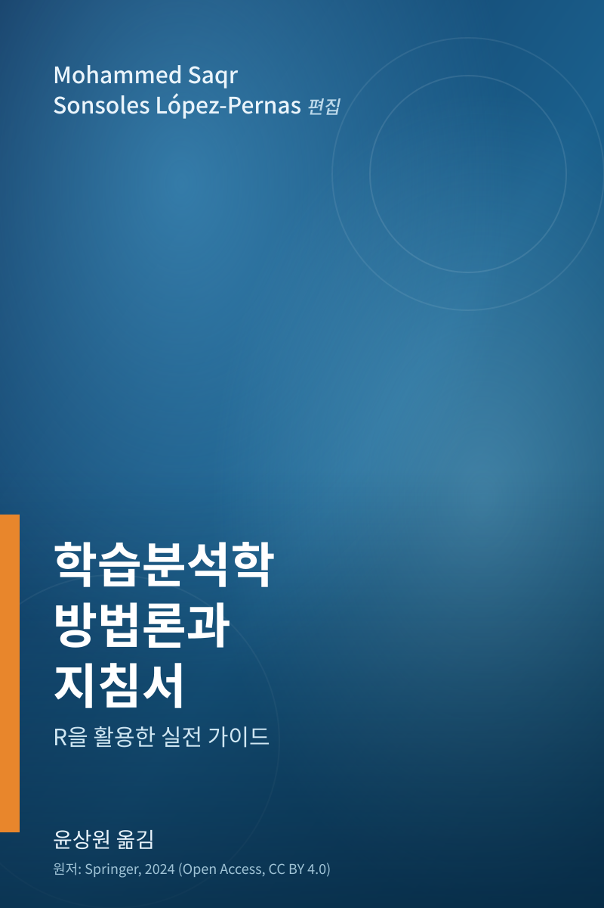

# 학습분석학 방법론과 실제 {.unnumbered}

:::: {.columns}

::: {.column width="30%"}

:::

::: {.column width="8%"}
:::

::: {.column width="62%"}
2026년 여름, 이 책의 편집자인 Mohammed Saqr, Sonsoles López-Pernas 두 분이 이끄는 동핀란드대학교(University of Eastern Finland) 학습분석학 연구단(Learning Analytics Unit)의 여름학교에 참여하면서 이 책을 처음 접했다. 학습분석학은 그동안 체계적으로 정리된 방법론 자료가 부족해 입문자들이 각자 힘겹게 길을 찾아야 했던 분야인데, 이 책은 R을 이용한 데이터 정제와 기초 통계부터 시작해 예측 모델링, 군집분석, 시계열·순차 분석 같은 고급 방법론까지 실제 학습분석 데이터로 단계를 밟아가며 익힐 수 있도록 구성되어 있다.

이렇게 폭넓고 실용적인 내용을 국내에도 소개할 가치가 있다고 생각해, 여름학교에서 배운 내용을 복습하고 책에 담긴 R 코드를 직접 하나씩 실행하며 검증해보는 개인 공부 목적을 겸해 번역 작업을 시작했다. 그 결과물을 이 사이트에 정리해 공유하며, 언젠가 기회가 닿는다면 정식 번역서 출간으로도 이어지길 바란다.
:::

::::

## 원서 정보

- 원저자: Mohammed Saqr, Sonsoles López-Pernas
- 원서명: *Learning Analytics Methods and Tutorials: A Practical Guide Using R*
- 원문: [lamethods.org/book1](https://lamethods.org/book1/)
- 출판사(Springer): [doi.org/10.1007/978-3-031-54464-4](https://doi.org/10.1007/978-3-031-54464-4)

## 라이선스

원서는 [Creative Commons Attribution 4.0 International License (CC BY 4.0)](http://creativecommons.org/licenses/by/4.0/)로 공개되어 있으며, 이 한국어판도 동일한 라이선스를 따릅니다.

> 이 책은 원저자 Mohammed Saqr, Sonsoles López-Pernas가 CC BY 4.0 라이선스로 공개한 원서를 한국어로 번역한 것입니다. 원문은 [lamethods.org/book1](https://lamethods.org/book1/)에서 확인할 수 있습니다.

## 번역자

- 윤상원 (연구원, Norwegian Knowledge Centre for Education)